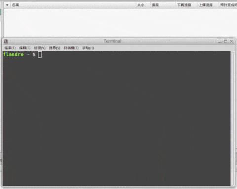

# dmhy-subscribe

Subscribe and schedule downloading magnets on dmhy. Support Linux & Windows 10.

在動漫花園訂閱並排程下載磁鏈，支援 Linux & Windows 10

## Demo

<p align="center">
  
</p>

## Requirement

### node & npm
- Recommend using [creationix/nvm](https://github.com/creationix/nvm)
 or [tj/n](https://github.com/tj/n) on Linux
- Recommend using [official installer](https://nodejs.org/) on Windows 10

### deluge & deluge-console

Linux:
```
$ sudo add-apt-repository ppa:deluge-team/ppa
$ sudo apt update
$ sudo apt install deluge deluged deluge-console
```

Windows 10:
Use [official installer](http://dev.deluge-torrent.org/wiki/Download)

## Installation

```
$ npm i -g dmhy-subscribe
```

## Usage

```
  Usage: dmhy [options] [command]


  Options:

    -V, --version  output the version number
    -h, --help     output usage information


  Commands:

    add [options] [anime...]
      Add <anime> to subscribe.

      A <anime> contains a name and following keywords
      to identify series you want to download, then
      joins them by CSV format in a string.

      Examples:

        Direct:
          $ dmhy add '紫羅蘭永恆花園,動漫國,繁體,1080P'
          $ dmhy add '紫羅蘭永恆花園,動漫國,繁體,1080P' 'pop team epic,極影,BIG5'

        File:
          $ dmhy ls --addable > a.txt
          $ dmhy rm --all
          $ dmhy add --file a.txt

    remove|rm [options] [vid...]
      Unsubscribe <anime> by <vid>.

      The <vid> are listed at `$ dmhy list`.

      Examples:
        $ dmhy rm XYZ ABC
        $ dmhy rm -a

    download|dl [epid...]
      Download <episode> of <anime> which are subscribed.

      The epid format: <vid>-<ep>
      <ep> : int | float | 'all' | <ep>..<ep> | <ep>,<ep>

      If only <vid>, means <vid>-all.

      Examples:
        $ dmhy download ABC-01 DEF
        $ dmhy dl XYZ-5.5 QWE-all ZZZ-1,3..5,6,8

    list|ls [options]
      List all <anime> which are subscribed.
```

## Work with crontab/pm2

cron format: http://www.nncron.ru/help/EN/working/cron-format.htm

### Linux

Check and fetch every 6 hour
```
$ (crontab -l 2>/dev/null; echo "0 */6 * * * `which dmhy`") | crontab -
```

Use [pm2](http://pm2.keymetrics.io/) instead
```
$ npm i -g pm2
$ pm2 start dmhy --cron '0 */6 * * *'
$ pm2 ls
```

### Windows 10

There are some previous work for Windows 10:

- Add deluge path (`C:\Program Files (x86)\deluge` in default) into PATH environment variable *or* open **PowerShell(Administrator)** and type following shell script to complete previous work
  ```shell
  PS C:\>  $delugepath = 'C:\Program Files (x86)\deluge' # Your deluge path
  PS C:\>  $oldpath = [Environment]::GetEnvironmentVariable("Path", [EnvironmentVariableTarget]::Machine)
  PS C:\>  $newpath = "$oldpath;$delugepath"
  PS C:\>  [Environment]::SetEnvironmentVariable("Path", "$newPath", [EnvironmentVariableTarget]::Machine)
  PS C:\>  exit # To reload profile
  ```
- Goto your deluge path and execute `deluged.exe` *or* open **PowerShell(Administrator)** and type `deluged` to execute deamon

Test previous work with PowerShell:
```
PS C:\>  deluge-console info
# if no error, OK.
# if error message is "Failed to connect to ..." means deluged.exe isn't opened.
```

Use [pm2](http://pm2.keymetrics.io/) with PowerShell
```
PS C:\>  npm i -g pm2 # Install pm2
PS C:\>  pm2 start %appdata%\npm\node_modules\dmhy-subscribe\index.js --name "dmhy" --cron "* */6 * * *"
PS C:\>  pm2 ls
```

### Windows 10 中文版

Windows 10 需要做些前置作業:

- 把 deluge 路徑 (預設是 `C:\Program Files (x86)\deluge`) 加到 PATH 環境變數 *或* 打開 **PowerShell(系統管理員)** 並輸入以下指令完成前置作業
  ```shell
  PS C:\>  $delugepath = 'C:\Program Files (x86)\deluge' # 你的 deluge 路徑
  PS C:\>  $oldpath = [Environment]::GetEnvironmentVariable("Path", [EnvironmentVariableTarget]::Machine)
  PS C:\>  $newpath = "$oldpath;$delugepath"
  PS C:\>  [Environment]::SetEnvironmentVariable("Path", "$newPath", [EnvironmentVariableTarget]::Machine)
  PS C:\>  exit # 關掉重開是必須的
  ```
- 到 deluge 路徑執行 `deluged.exe` *或*  打開 **PowerShell(系統管理員)** 並輸入 `deluged` 執行服務

用 PowerShell 測試前置作業是否成功 :
```
PS C:\>  deluge-console info
# 如果沒有錯誤就完成了.
# 如果錯誤訊息是 "Failed to connect to ..." 代表 deluged.exe 沒打開
```

在 PowerShell 使用 [pm2](http://pm2.keymetrics.io/)
```
PS C:\>  npm i -g pm2 # 安裝 pm2
PS C:\>  pm2 start %appdata%\npm\node_modules\dmhy-subscribe\index.js --name "dmhy" --cron "* */6 * * *"
PS C:\>  pm2 ls
```
